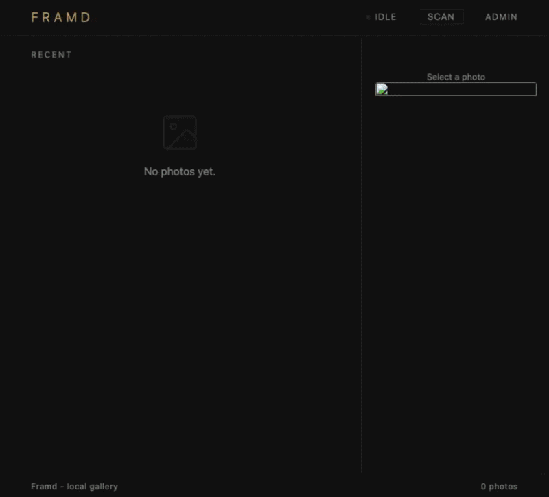

# Framd

A self-hosted local media management app built for NAS deployment. Framd indexes your media library, generates previews, and serves them through a lightweight web UI, with planned support for library auditing, EXIF validation, and metadata analysis. Built with Spring Boot, PostgreSQL, HTMX, and Thymeleaf.

For a detailed write-up of the design decisions and progress, see the [project blog](https://romanempire.dev/tags/frame/).

---

## Features

See [FEATURES.md](FEATURES.md) for the full list of planned and in-progress features.

## Docker

See example [`docker-compose.yaml`](docker/nas/docker-compose.yaml) and [`.env`](docker/nas/.env) in `docker/nas/`.

## Development

See [DEV_README.md](DEV_README.md) for local development setup, testing, linting, Docker builds, and Spring profiles.

---

> **A note on the frontend:** This is a backend-focused project. The UI was built with AI assistance as a functional interface to the backend and is intentionally minimal. It is not intended to showcase frontend work.
